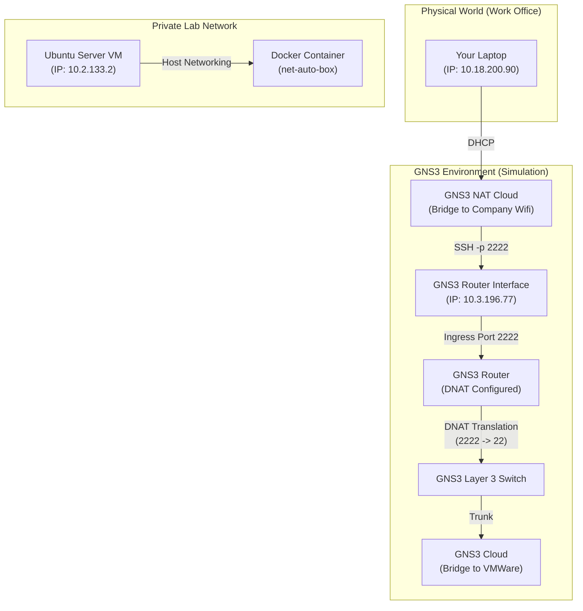

# Nested Lab Access Workflow

> Bridging physical networks to virtualized GNS3 environments via NAT.

This is a sophisticated "nested" workflow that relies on your employer's routing to bridge your physical location (Work WiFi) with your virtualized lab environment (GNS3/VMware), using Network Address Translation (NAT) to traverse the boundaries.

Here is the breakdown of your workflow, visualized and explained step-by-step.

### The Traffic Flow Diagram

---

### Step-by-Step Explanation

#### 1. The Ingress (Physical to Virtual)

- **Source:** You start on your laptop connected to the Work WiFi (`10.18.200.90`).
- **Destination:** You initiate an SSH connection to `10.3.196.77` on port `2222`.
- **The Bridge:** Because your employer has configured static routing, your laptop knows how to reach the `10.3.196.x` subnet. This subnet exists on the "Cloud" interface of your GNS3 environment, effectively bridging your virtual lab router to the physical corporate network.

#### 2. The Router & Translation (DNAT)

- **The Intermediary:** The traffic hits the outside interface of your GNS3 router (`10.3.196.77`).
- **The Logic:** The router listens on port `2222` because of a **Destination NAT (DNAT)** rule.
- **The Translation:** The router takes that traffic and "translates" the destination IP from the public-facing `10.3.196.77` to the private, internal IP `10.2.133.2`. It likely also translates the port (e.g., mapping external port `2222` to standard SSH port `22` on the VM).

#### 3. The Target (Ubuntu VM)

- **The Landing:** The packet traverses the private lab network and lands on the VMware Ubuntu Server (`10.2.133.2`).
- **Authentication:** You authenticate as user `dusts`, establishing the SSH session. You are now inside the VM.

#### 4. The Tooling (Docker Container)

- **Execution:** You run `docker run -it --network host ...`.
- **Network Identity:** Because you use `--network host`, the container does **not** get its own isolated IP. It shares the networking namespace of the Ubuntu VM (`10.2.133.2`).
- **Persistence:** The `-v $(pwd):/usr/src/app` flag mounts your current directory into the container, allowing your automation scripts to read/write files directly on the VM's filesystem.

### Summary for Documentation

> "I connect from the Corporate WiFi (`10.18.x.x`) to the GNS3 lab edge router (`10.3.196.77`) via SSH on port 2222. The lab router utilizes DNAT to forward this traffic to an internal Ubuntu VM (`10.2.133.2`) hosting the automation environment. Once inside the VM, I spin up a 'net-auto-box' Docker container using host networking to execute automation tasks."

Would you like me to generate a configuration snippet (like an `iptables` or Cisco IOS NAT rule) that effectively replicates the "Router" part of this setup?
